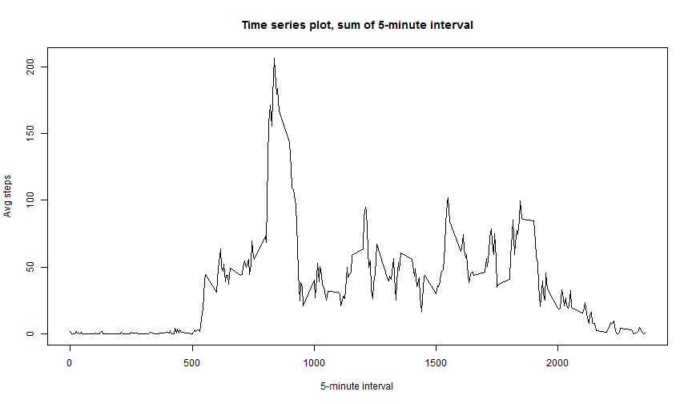

# Reproducible Research - Peer Assessment 1
by Bruno Viana Basto
2014.11.15


## Loading and preprocessing the data

1.Load the data


```r
fileZip <- "activity.zip"
fileCSV <- "activity.csv"
act <- read.csv(unz(fileZip, fileCSV))
```

This dataset is the one the came from git but it can be downloaded through the following link
https://d396qusza40orc.cloudfront.net/repdata%2Fdata%2Factivity.zip

2.Process/transform the data (if necessary) into a format suitable for your analysis


```r
#investigate and understand the dataset
names(act)
```

```
## [1] "steps"    "date"     "interval"
```

```r
nrow(act)
```

```
## [1] 17568
```

```r
head(act,10)
```

```
##    steps       date interval
## 1     NA 2012-10-01        0
## 2     NA 2012-10-01        5
## 3     NA 2012-10-01       10
## 4     NA 2012-10-01       15
## 5     NA 2012-10-01       20
## 6     NA 2012-10-01       25
## 7     NA 2012-10-01       30
## 8     NA 2012-10-01       35
## 9     NA 2012-10-01       40
## 10    NA 2012-10-01       45
```

```r
#know the data
table(act$date)
```

```
## 
## 2012-10-01 2012-10-02 2012-10-03 2012-10-04 2012-10-05 2012-10-06 
##        288        288        288        288        288        288 
## 2012-10-07 2012-10-08 2012-10-09 2012-10-10 2012-10-11 2012-10-12 
##        288        288        288        288        288        288 
## 2012-10-13 2012-10-14 2012-10-15 2012-10-16 2012-10-17 2012-10-18 
##        288        288        288        288        288        288 
## 2012-10-19 2012-10-20 2012-10-21 2012-10-22 2012-10-23 2012-10-24 
##        288        288        288        288        288        288 
## 2012-10-25 2012-10-26 2012-10-27 2012-10-28 2012-10-29 2012-10-30 
##        288        288        288        288        288        288 
## 2012-10-31 2012-11-01 2012-11-02 2012-11-03 2012-11-04 2012-11-05 
##        288        288        288        288        288        288 
## 2012-11-06 2012-11-07 2012-11-08 2012-11-09 2012-11-10 2012-11-11 
##        288        288        288        288        288        288 
## 2012-11-12 2012-11-13 2012-11-14 2012-11-15 2012-11-16 2012-11-17 
##        288        288        288        288        288        288 
## 2012-11-18 2012-11-19 2012-11-20 2012-11-21 2012-11-22 2012-11-23 
##        288        288        288        288        288        288 
## 2012-11-24 2012-11-25 2012-11-26 2012-11-27 2012-11-28 2012-11-29 
##        288        288        288        288        288        288 
## 2012-11-30 
##        288
```

```r
class(act$date)
```

```
## [1] "factor"
```

```r
#convert to date
act$date <- as.Date(act$date)
```


## What is mean total number of steps taken per day?


```r
#ignoring steps NA
actNAOut <- act[!is.na(act$steps), ]
```


1 Make a histogram of the total number of steps taken each day


```r
#First, calculate set  with summarization by number of steps
library(plyr)
actNAOutByDate <- ddply(actNAOut, ~date, summarise, sum = sum(steps))
head(actNAOutByDate)
hist(actNAOutByDate$sum, col="darkBlue", xlab="Steps p/day", ylab="days with this sum of steps"
        ,main="Number of steps taken each day")
```

 

2.Calculate and report the mean and median total number of steps taken per day

Mean value 

```r
print(mean(actNAOutByDate$sum))
```

```
## [1] 10766.19
```

Median

```r
print(median(actNAOutByDate$sum))
```

```
## [1] 10765
```


## What is the average daily activity pattern?

1.Make a time series plot of the 5-minute interval and the average number of steps


```r
#get the average by inteval
actNAOutAvgPerInterval <- ddply(actNAOut, .(interval), summarise, avgSteps = mean(steps))
head(actNAOutAvgPerInterval)
#plot intevals on x, avg on y
plot(actNAOutAvgPerInterval$interval, actNAOutAvgPerInterval$avgSteps, 
     type='l', xlab = '5-minute interval', ylab = 'Avg steps', 
     main='Time series plot, sum of 5-minute interval')
```

 

2. the maximum number of steps?

```r
#first calculate the max value
maxValStepsactNAOut <- max(actNAOutAvgPerInterval$avgSteps)
#filter set by max value and extract interval
print(actNAOutAvgPerInterval[actNAOutAvgPerInterval$avgSteps == maxValStepsactNAOut, ]$interval)
```

```
## [1] 835
```


## Imputing missing values

1.number of missing values?

```r
print(sum(is.na(act$steps)))
```

```
## [1] 2304
```

2.strategy for filling in all of the missing values

The resulting dataset will use the avareges for each interval calculated in previous step. When an interval have a NA, it will be substituted by the global avarege: calculated with the set without NA

3.new dataset dataset but with the missing data filled in.

```r
#this is the new dataset
actV2 <- act
#identify the rows that need correction
actV2NARows <- is.na(actV2$steps)
#now the steps pre-identified will be corrected with values calculated on
#previous step
actV2[actV2NARows,]$steps <- actNAOutAvgPerInterval[match(actV2[actV2NARows,]$interval
                        , actNAOutAvgPerInterval$interval), "avgSteps"]
head(act)
```

```
##   steps       date interval
## 1    NA 2012-10-01        0
## 2    NA 2012-10-01        5
## 3    NA 2012-10-01       10
## 4    NA 2012-10-01       15
## 5    NA 2012-10-01       20
## 6    NA 2012-10-01       25
```

```r
head(actV2)
```

```
##       steps       date interval
## 1 1.7169811 2012-10-01        0
## 2 0.3396226 2012-10-01        5
## 3 0.1320755 2012-10-01       10
## 4 0.1509434 2012-10-01       15
## 5 0.0754717 2012-10-01       20
## 6 2.0943396 2012-10-01       25
```


4.Make a histogram of the total number of steps taken each day and Calculate and report the mean and median total number of steps taken per day. 

```r
#Same peocess of previous step, but now with the new dataset
actV2ByDate <- ddply(actV2, ~date, summarise, sum = sum(steps))
hist(actV2ByDate$sum, col="darkBlue", xlab="Steps p/day", ylab="days with this sum of steps"
     ,main="Number of steps taken each day, NA elimited with global average of the interval")
```

 

Mean value 

```r
print(mean(actV2ByDate$sum))
```

```
## [1] 10766.19
```

Median

```r
print(median(actV2ByDate$sum))
```

```
## [1] 10766.19
```


The new dataset, filled with the avarege vales on the NA, change the histogram because, know we have all this ficticious values when on the previous they were null/NA.

The mean and the median doesn't change much but, the median aproaches the mean, mostly because of the way that the NA were changed.


## Are there differences in activity patterns between weekdays and weekends?

1.Create a new factor variable in the dataset with two levels - "weekday" and "weekend" based on date


```r
#in order to the folwing line work with different cultures, set the weekday name to english 
Sys.setlocale("LC_TIME", "C")
#create the new column based on the day of the week
actV2$WeekDayType  <- ifelse(weekdays(actV2$date) == "Saturday" | weekdays(actV2$date) == 
                       "Sunday", "Weekend", "Weekday")
#convert the new column to factor       
actV2$WeekDayType <- as.factor(actV2$WeekDayType)
head(actV2)
```

2.Make a panel plot containing a time series plot of the 5-minute interval and the average number of steps taken, averaged across all weekday days or weekend days.


```r
#summarize like before but know algo group by weekday type 
actV2DayTypeComparsion <- ddply(actV2, .(interval, WeekDayType), summarise, avgSteps = mean(steps))
#and plot the comparsion
library('lattice')
xyplot(avgSteps ~ interval | WeekDayType, data = actV2DayTypeComparsion, type = "l"
        , layout=c(1,2), xlab = 'interval', ylab = 'steps')
```

 


This page was generated through the use of the following comands


    install.packages('knitr', dependencies = TRUE)
    library(knitr)
    knit2html("PA1_template.Rmd")


the path for the figures was not changed.


